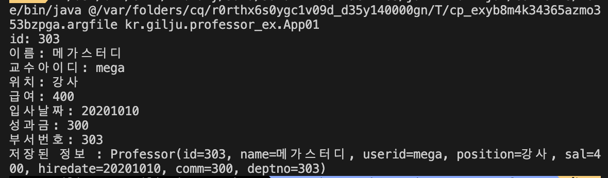
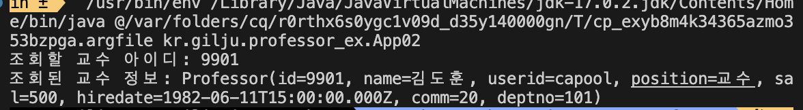
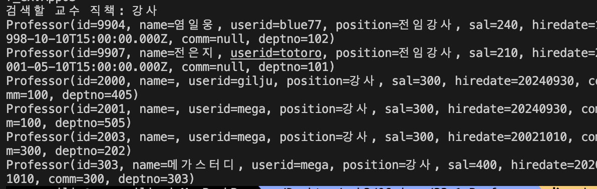
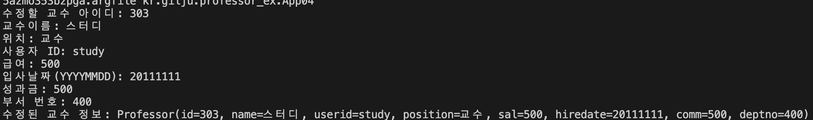

# Proressor_송길주
> 2024-10-01
>
---
## model code
```
package kr.gilju.model;

import lombok.Data;

@Data
public class Professor {
  private int id; //교수 ID
  private String name; // 교수이름
  private String userid; // 교수아이디
  private String position; // 위치/직책
  private int sal; // 교수 급여
  private String hiredate; //입사날짜
  private Integer comm; // 성과금 / 숫자, null 둘다 가능 
  private int deptno; // 부서번호
}
```
---
## service code
```package kr.gilju.service;

import java.util.List;

import kr.gilju.model.Professor;
import retrofit2.Call;
import retrofit2.http.Field;
import retrofit2.http.FormUrlEncoded;
import retrofit2.http.GET;
import retrofit2.http.POST;
import retrofit2.http.PUT;
import retrofit2.http.Path;
import retrofit2.http.Query;

public interface ProfessorService {
  public static final String BASE_URL = "http://localhost:3001";

  /**
   * 교수 정보
   *
   * @param id 교수 ID
   * @param name  교수 이름
   * @param userid   교수아이디
   * @param position 위치/직책
   * @param sal 급여
   * @param hiredate 입사날짜
   * @param comm   성과금 / 숫자, null 둘 다 가능
   * @param deptno 부서번호
   * @return
   */
  @FormUrlEncoded
  @POST("/professor")
  Call<Professor> addProfessor(
      @Field("id") int id,
      @Field("name") String name,
      @Field("userid") String userid,
      @Field("position") String position,
      @Field("sal") int sal,
      @Field("hiredate") String hiredate,
      @Field("comm") Integer comm,
      @Field("deptno") int deptno);

  // 특정 교수 조회
  @GET("/professor/{id}")
  Call<Professor> getProfessor(@Path("id") int id);

  // 교수 목록 조회 
  @GET("/professor")
  Call<List<Professor>> listProfessor(@Query("position_like") String position);

  // 교수 정보 수정
  @FormUrlEncoded
  @PUT("/professor/{id}")
  Call<Professor> updateProfessor(@Path("id") int id,
      @Field("name") String name,
      @Field("userid") String userid,
      @Field("position") String position,
      @Field("sal") int sal,
      @Field("hiredate") String hiredate,
      @Field("comm") Integer comm,
      @Field("deptno") int deptno);

  // 교수 정보 삭제 
  @GET("/professor/{id}")
  Call<Professor> deleteProfessor(@Path("id") int id);
}
```
---
## 1.App1


---
## 2.App2


---
## 3.App3


---
## 4.App4


---
## 5.App5
